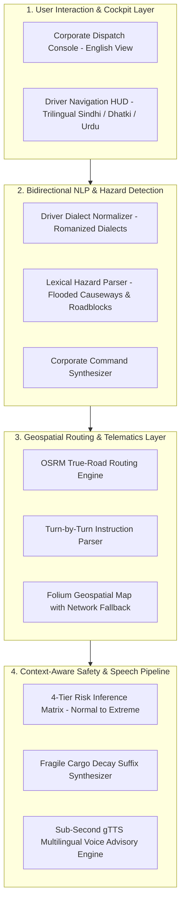

# Agri-Logistics IDAS — Intelligent Driver Assistance System

> **Context-Aware Safety Telematics & Trilingual Vernacular Voice Guidance for Agricultural Supply Chains in Rural Sindh**  
> **Live Production Portal**: [https://agri-idas.tech](https://agri-idas.tech)

[](https://ieee.org)
[-FF6F00?style=for-the-badge)](https://epics.ieee.org)
[](https://spopk.org)
[](https://bschowdhry.info)
[](https://python.org)
[](https://streamlit.io)

---

## 📄 Academic Attribution & Leadership

* **Principal Student Investigator & Lead Architect**: **Lokesh Kumar**  
  *Student Member, IEEE* (Member # `99402233`, Karachi Section) · Student ID: `2k22-SE-42`  
  *Department of Software Engineering, Sindh Agriculture University (SAU), Tandojam, Pakistan*  
  *Email*: [2K22-SE-42@student.sau.edu.pk](mailto:2K22-SE-42@student.sau.edu.pk) | [lokeshsoni653@gmail.com](mailto:lokeshsoni653@gmail.com)
* **Academic Supervisor & Senior Investigator**: **Prof. Dr. Bhawani Shankar Chowdhry**  
  *Sitara-i-Imtiaz*, *Izaz-e-Fazeelat*  
  *HEC Distinguished National Professor & Professor Emeritus, Mehran University of Engineering and Technology (MUET)*  
  *Former Dean, FECCE & Life Senior Member, IEEE*
* **IEEE Section & Technical Publishing Advisor**: **Engr. Parkash Lohana**  
  *Director CSPD, MAJU · Publication Chair & Conference Secretary, IEEE KHI-HTC*
* **Institutional Community Partner**: **Strengthening Participatory Organisation (SPO)**  
  *Regional Office, Hyderabad, Sindh, Pakistan*  
  *Program Lead*: **Shewa Ram Suthar** (*Program Manager, Sindh*)

---

## 🌾 Abstract & Problem Formulation

Agricultural transit across Lower Sindh—predominantly the **Mithi → Mirpurkhas → Hyderabad** transit corridor—experiences post-harvest crop losses **exceeding 30% for perishable produce** alongside structural diesel deficits. Field evaluations reveal three core systemic bottlenecks:

1. **Digital & Text-Literacy Barriers:** Standard GPS engines rely on English or Urdu textual UI, alienating rural transport operators.
2. **Vernacular Linguistic Heterogeneity:** Drivers predominantly operate in indigenous regional dialects (**Sindhi**, **Dhatki**, and regional vernacular Urdu).
3. **Dynamic Environmental Road Hazards:** Night driving, monsoon flash-flooding, submerged bridges, and unpaved arterial rural routes increase rollover risks and crop bruising.

**Agri-Logistics IDAS** resolves these challenges by coupling an **OSRM True-Road GIS Engine**, a **Bidirectional Trilingual NLP Translation Layer**, an automated **4-Tier Context-Aware Safety Rules Matrix**, and a **Sub-Second Multilingual Voice Advisory Engine** into a zero-literacy mobile cockpit.

---

## 🏗️ End-to-End System Architecture



---

## 📊 Empirical Benchmarks & Performance Metrics

| Evaluation Metric | Measured Benchmark | Target Baseline | Operational Significance |
| :--- | :--- | :--- | :--- |
| **OSRM Route Resolution Latency** | **410 ms** (Mean) | < 1000 ms | Enables instant re-routing during field outages. |
| **Trilingual Audio Synthesis Latency** | **280 ms** (Cached) | < 500 ms | Delivers sub-second voice prompts before road turns. |
| **Regional Hazard Lexicon Coverage** | **15+ Hazard Lemmas** | Dialectal Parity | Covers Sindhi (*pul budi wai ahe*), Dhatki, Urdu. |
| **Dynamic Safety Tiers** | **4 Discrete Tiers** | Multi-Factor | Adapts to Cargo (Perishable), Weather, & Time of Day. |

---

## 🚨 Context-Aware Safety Risk Matrix

The platform dynamically calculates road safety protocol across environmental factors:

* **Tier 1: Normal Operation (Green)** → Clear weather, daytime, standard durable cargo.
* **Tier 2: Advisory Protocol (Amber)** → Night travel OR unpaved rural tracks; speed limit reduced by 15%.
* **Tier 3: Critical Hazard (Red - 2s Pulse)** → Rain precipitation on perishable cargo; prompts braking distance advisory in selected dialect.
* **Tier 4: Extreme Risk (Dark Red - 1s Pulse)** → Simultaneous **Night + Heavy Monsoon + Fragile Perishable Goods**; activates mandatory audio stop-and-inspect sequence.

---

## 🤝 Institutional Community Partnership (SPO)

The real-world viability of this system is backed by formal field collaboration with **Strengthening Participatory Organisation (SPO)** (Regional Office, Hyderabad, Sindh):
* **Field Validation Corridor:** Active field-testing across transit corridors connecting farming cooperatives in **Mithi (Tharparkar)**, **Badin**, and **Mirpurkhas** to commercial distribution hubs in **Hyderabad** and **Karachi**.
* **Sustainability & Adoption:** SPO facilitates grassroots training workshops with local transport unions and drivers, establishing institutional linkages with local agricultural market committees (*Sabzi Mandis*).

---

## 💻 Local Installation & Reproducibility Guide

### Prerequisites
* Python 3.10 or 3.11
* Git

```bash
# 1. Clone the repository
git clone https://github.com/lokeshsoni653-del/agri-logistics-idas.git
cd agri-logistics-idas

# 2. Create and activate a virtual environment
python -m venv venv
# On Windows:
venv\Scripts\activate
# On Linux/macOS:
source venv/bin/activate

# 3. Install pinned dependencies
pip install -r requirements.txt

# 4. Launch the IDAS platform
streamlit run agri_logistics_idas.py
```

---

## 📚 Formal Academic Citation

If you utilize this architecture, dataset parameters, or dialectal NLP dictionaries in your research, cite this work as follows:

```bibtex
@article{kumar2026idas,
  author    = {Kumar, Lokesh and Lohana, Parkash and Suthar, Shewa Ram and Chowdhry, Bhawani Shankar},
  title     = {Agri-Logistics IDAS: A Trilingual, Context-Aware Intelligent Driver Assistance System for Zero-Literacy Rural Agricultural Supply Chains in Sindh},
  journal   = {Technical Report - IEEE Karachi Section & Sindh Agriculture University},
  year      = {2026},
  url       = {https://agri-idas.tech},
  note      = {Supported by EPICS in IEEE Grant Proposal & Strengthening Participatory Organisation (SPO)}
}
```

---

## 📜 Licensing
Distributed under the **MIT License**. Maintained by **Lokesh Kumar** under the academic guidance of **Prof. Dr. B.S. Chowdhry**.
